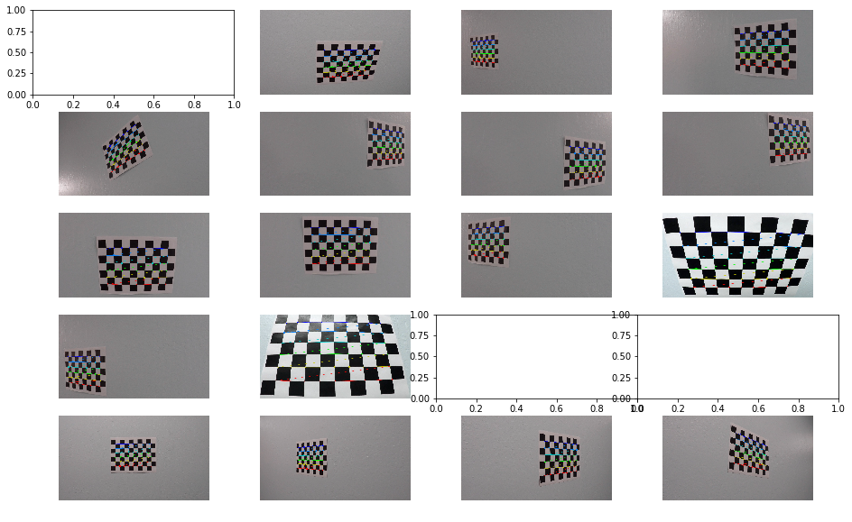

## Advanced Lane Finding Project

---

The goals / steps of this project are the following:

* Compute the camera calibration matrix and distortion coefficients given a set of chessboard images.
* Apply a distortion correction to raw images.
* Use color transforms, gradients, etc., to create a thresholded binary image.
* Apply a perspective transform to rectify binary image ("birds-eye view").
* Detect lane pixels and fit to find the lane boundary.
* Determine the curvature of the lane and vehicle position with respect to center.
* Warp the detected lane boundaries back onto the original image.
* Output visual display of the lane boundaries and numerical estimation of lane curvature and vehicle position.

[//]: # (Image References)

[image1]: ./output_images/undistorted_output.png "Undistorted"
[image2]: ./test_images/test1.jpg "Road Transformed"
[image3]: ./examples/binary_combo_example.jpg "Binary Example"
[image4]: ./examples/warped_straight_lines.jpg "Warp Example"
[image5]: ./examples/color_fit_lines.jpg "Fit Visual"
[image6]: ./examples/example_output.jpg "Output"
[video1]: ./project_video.mp4 "Video"

## [Rubric](https://review.udacity.com/#!/rubrics/571/view) Points

### Here I will consider the rubric points individually and describe how I addressed each point in my implementation.  

---

### Camera Calibration

#### 1. Briefly state how you computed the camera matrix and distortion coefficients. Provide an example of a distortion corrected calibration image.

The code for this step is contained in the first code cell of the IPython notebook located in "./ALL.ipynb"  

    def ChessboardPoints(img,grid=(9,6)):  
        objp = np.zeros((grid[0]*grid[1],3), np.float32)
        objp[:,:2] = np.mgrid[0:grid[0], 0:grid[1]].T.reshape(-1,2)
        objpoints = [] 
        imgpoints = [] 
        gray = cv2.cvtColor(img,cv2.COLOR_BGR2GRAY)
        ret, corners = cv2.findChessboardCorners(gray, (9,6), None)
        if ret == True:
            objpoints.append(objp)
            imgpoints.append(corners)
        return objpoints,imgpoints
    
For ChessboardPoints() function above, I start by preparing "object points", which will be the (x, y, z) coordinates of the chessboard corners in the world. Here I am assuming the chessboard is fixed on the (x, y) plane at z=0, such that the object points are the same for each calibration image.  Thus, `objp` is just a replicated array of coordinates, and `objpoints` will be appended with a copy of it every time I successfully detect all chessboard corners in a test image.  `imgpoints` will be appended with the (x, y) pixel position of each of the corners in the image plane with each successful chessboard detection.  

And for corners drawing, using `cv2.drawChessboardCorners()`function can directly obtained results. Here are results from different angles:



    def cal_undistort(img, objpoints, imgpoints):
        img_size = (img.shape[1], img.shape[0]) 
        ret, mtx, dist, rvecs, tvecs = cv2.calibrateCamera(objpoints, imgpoints, img_size, None, None)
        dst = cv2.undistort(img, mtx, dist, None, mtx)
        return dst
    
Then I used the output `objpoints` and `imgpoints` to compute the camera calibration and distortion coefficients using the `cv2.calibrateCamera()` function.  I applied this distortion correction to the camera_cal and test image using the `cv2.undistort()` function and obtained this result: 


![alt text][image1]


### Pipeline (single images)

#### 1. Provide an example of a distortion-corrected image.

After obtaining objpoints and imgpoints based on different referenced direction, we can using these points to carlibrate distorted images. Here is result:


In this camera case, it can hardly see the change unless you watch the hood of car below the image carefully. 

#### 2. Describe how (and identify where in your code) you used color transforms, gradients or other methods to create a thresholded binary image.  Provide an example of a binary image result.

I tried several methods to check which one or combined made good effort. Firstly, I used Sobel algorithm, took an absolute and applied a
threshold.

    def abs_sobel_thresh(img, orient,sobel_kernel,thresh):
        gray = cv2.cvtColor(img,cv2.COLOR_RGB2GRAY)
        if orient == 'x':
            sobel = cv2.Sobel(gray,cv2.CV_64F,1,0,ksize=sobel_kernel)
            abs_sobel = np.absolute(sobel)
        elif orient == 'y':
            sobel = cv2.Sobel(gray,cv2.CV_64F,0,1,ksize=sobel_kernel)
            abs_sobel = np.absolute(sobel)
        else:
            print('input error: orient should be x or y')
        scaled_sobel = np.uint8(255*abs_sobel/np.max(abs_sobel))
        sxbinary = np.zeros_like(scaled_sobel)
        sxbinary[(scaled_sobel >= thresh[0]) & (scaled_sobel <= thresh[1])] = 1
        return sxbinary
   
    def mag_thresh(img, sobel_kernel, mag_thresh):
        gray = cv2.cvtColor(img, cv2.COLOR_RGB2GRAY)
        sobelx = cv2.Sobel(gray, cv2.CV_64F,1,0, ksize=sobel_kernel)
        sobely = cv2.Sobel(gray, cv2.CV_64F,0,1, ksize=sobel_kernel)
        abs_sobelxy = np.sqrt(sobelx **2 + sobely **2)
        scaled_sobel = np.uint8(255 * abs_sobelxy/np.max(abs_sobelxy))
        sxybinary = np.zeros_like(scaled_sobel)
        sxybinary[(scaled_sobel >= mag_thresh[0]) & (scaled_sobel <= mag_thresh[1])] = 1
        return sxybinary
             
     def dir_threshold(img, sobel_kernel, thresh):
        gray = cv2.cvtColor(img, cv2.COLOR_RGB2GRAY)
        sobelx = cv2.Sobel(gray, cv2.CV_64F,1,0,ksize=sobel_kernel)
        sobely = cv2.Sobel(gray, cv2.CV_64F,0,1,ksize=sobel_kernel)
        sobelxy = np.sqrt(sobelx ** 2 +sobely **2)
        abs_sobelx = np.absolute(sobelx)
        abs_sobely = np.absolute(sobely)
        grad = np.arctan2(abs_sobely, abs_sobelx)
        binary_output = np.zeros_like(grad)
        return binary_output

Here is just one result using sobel x binary:


It showed that 'abs_sobel_thresh' with sobel x did a good job, the lane line  can mostly be displayed. It proved that applying sobel x  emphasized edges closer to vertical, while applying sobel y emphasizes edges closer to horizontal. But some images from NO.3/4/5 row above showed sobel x(and other combinations) did bad, especially when it came to positions with high brightness. 

So we need to combine gradient threshold with color threhold. Color threshold(HLS) showed its effect in detecting lines in groud with high brightness.Among three channels(H,L,S), S channel did the best. 

    def hls_select(img, channel='s',thresh=(175,255)):
        hls = cv2.cvtColor(img, cv2.COLOR_RGB2HLS)
        h_channel = hls[:,:,0]
        l_channel = hls[:,:,1]
        s_channel = hls[:,:,2]
        if channel =='h':
            binary_output = np.zeros_like(h_channel)
            binary_output[(h_channel >= thresh[0]) & (h_channel <= thresh[1])] = 1
        elif channel=='l':
            binary_output = np.zeros_like(l_channel)
            binary_output[(l_channel >= thresh[0]) & (l_channel <= thresh[1])] = 1
        elif channel =='s':
            binary_output = np.zeros_like(s_channel)
            binary_output[(s_channel >= thresh[0]) & (s_channel <= thresh[1])] = 1   
        else:
            print("channel should be h,l or s.")
        return binary_output

The right figure below showes an output of combination:

  


#### 3. Describe how (and identify where in your code) you performed a perspective transform and provide an example of a transformed image.

The code for my perspective transform includes a function called `warped()`, which mainly used `cv2.warpPerspective()`.  The `warped()` function takes as inputs an image (`img`), which has been undistorted and combined with color and gradient threshold. And three parameters including M, source (`src`) and destination (`dst`) points.  I chose directly to set the source and destination points by hard trial. The final result is in `M_Minv()` as below:

    def M_Minv():
        src = np.float32([[(180,719),(595,450),(685,450),(1120,719)]])
        dst = np.float32([[(310,719),(310,0),(960,0),(960,719)]])
        M = cv2.getPerspectiveTransform(src, dst)
        Minv = cv2.getPerspectiveTransform(dst,src)
        return M,Minv
        
    def warped(img):
        img_shape = (img.shape[1],img.shape[0])
        warped = cv2.warpPerspective(img, M, img_shape, flags=cv2.INTER_LINEAR) 
        return warped

I verified that my perspective transform was working as expected by drawing the `src` and `dst` points onto a test image and its warped counterpart to verify that the lines appear parallel in the warped image.


I construct a pipeline to combine these steps for convenient call.

```python
def pipeline(img):  
    # Distortion correction
    undist = cal_undistort(img,objpoints,imgpoints)
    # Get M/Minv
    M,Minv = M_Minv()
    # Gradient and color threshold
    gradx = abs_sobel_thresh(undist, orient='x',sobel_kernel=3,thresh=(50,150))
    grady = abs_sobel_thresh(undist, orient='y', sobel_kernel=3, thresh=(100, 150))
    #mag_binary = mag_thresh(undist, sobel_kernel=3, mag_thresh=(50, 120))
    dir_binary = dir_threshold(undist, sobel_kernel=3, thresh=(0.6, 1.4)) 
    s_binary = hls_select(undist, thresh=(175, 255))
    #combine gradx and hls thresholds
    combined = np.zeros_like(dir_binary)    
    combined[((gradx==1)|(s_binary==1))] = 1
    #combined[((gradx==1)|(grady==1)) & ((dir_binary == 1))|(s_binary==1)] = 1
    #Perspective Transform
    warped = cv2.warpPerspective(combined, M, (combined.shape[1],combined.shape[0]), flags=cv2.INTER_LINEAR)
    return warped, Minv
```
Here is the final result: 


#### 4. Describe how (and identify where in your code) you identified lane-line pixels and fit their positions with a polynomial?

Then I did some other stuff and fit my lane lines with a 2nd order polynomial kinda like this:

![alt text][image5]

#### 5. Describe how (and identify where in your code) you calculated the radius of curvature of the lane and the position of the vehicle with respect to center.

I did this in lines # through # in my code in `my_other_file.py`

#### 6. Provide an example image of your result plotted back down onto the road such that the lane area is identified clearly.

I implemented this step in lines # through # in my code in `yet_another_file.py` in the function `map_lane()`.  Here is an example of my result on a test image:

![alt text][image6]

---

### Pipeline (video)

#### 1. Provide a link to your final video output.  Your pipeline should perform reasonably well on the entire project video (wobbly lines are ok but no catastrophic failures that would cause the car to drive off the road!).

Here's a [link to my video result](./project_video.mp4)

---

### Discussion

#### 1. Briefly discuss any problems / issues you faced in your implementation of this project.  Where will your pipeline likely fail?  What could you do to make it more robust?

Here I'll talk about the approach I took, what techniques I used, what worked and why, where the pipeline might fail and how I might improve it if I were going to pursue this project further.  
