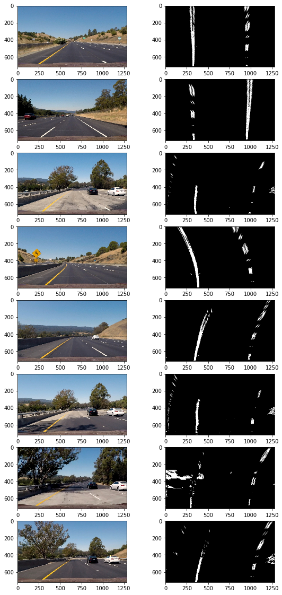

## Advanced Lane Finding Project
 

---
The goals / steps of this project are the following:

* Compute the camera calibration matrix and distortion coefficients given a set of chessboard images.
* Apply a distortion correction to raw images.
* Use color transforms, gradients, etc., to create a thresholded binary image.
* Apply a perspective transform to rectify binary image ("birds-eye view").
* Detect lane pixels and fit to find the lane boundary.
* Determine the curvature of the lane and vehicle position with respect to center.
* Warp the detected lane boundaries back onto the original image.
* Output visual display of the lane boundaries and numerical estimation of lane curvature and vehicle position.


## [Rubric](https://review.udacity.com/#!/rubrics/571/view) Points

### Here I will consider the rubric points individually and describe how I addressed each point in my implementation.  

---

### Camera Calibration

#### 1. Briefly state how you computed the camera matrix and distortion coefficients. Provide an example of a distortion corrected calibration image.

The code for this step is contained in the first step of the IPython notebook located in "./project.ipynb".  

```python
def ChessboardPoints(img,grid=(9,6)):  
    objp = np.zeros((grid[0]*grid[1],3), np.float32)
    objp[:,:2] = np.mgrid[0:grid[0], 0:grid[1]].T.reshape(-1,2)
    objpoints = [] 
    imgpoints = [] 
    gray = cv2.cvtColor(img,cv2.COLOR_BGR2GRAY)
    ret, corners = cv2.findChessboardCorners(gray, (9,6), None)
    if ret == True:
        objpoints.append(objp)
        imgpoints.append(corners)
    return objpoints,imgpoints
```    

For ChessboardPoints() function above, I started by preparing "object points", which would be the (x, y, z) coordinates of the chessboard corners in the world. Here I was assuming the chessboard is fixed on the (x, y) plane at z=0, such that the object points are the same for each calibration image.  Thus, `objp` is just a replicated array of coordinates, and `objpoints` would be appended with a copy of it every time I successfully detected all chessboard corners in test images.  `imgpoints` will be appended with the (x, y) pixel position of each of the corners in the image plane with each successful chessboard detection.  

And for corners drawing, using `cv2.drawChessboardCorners()`function can directly obtained results. Here are results from different angles:


```python
def cal_undistort(img, objpoints, imgpoints):
    img_size = (img.shape[1], img.shape[0]) 
    ret, mtx, dist, rvecs, tvecs = cv2.calibrateCamera(objpoints, imgpoints, img_size, None, None)
    dst = cv2.undistort(img, mtx, dist, None, mtx)
    return dst
```

Then I used the output `objpoints` and `imgpoints` to compute the camera calibration and distortion coefficients using the `cv2.calibrateCamera()` function.  I applied this distortion correction to the camera_cal and test image using the `cv2.undistort()` function and obtained this result: 


### Pipeline (single images)

#### 1. Provide an example of a distortion-corrected image.

After obtaining objpoints and imgpoints based on different referenced direction, we can use these points to carlibrate distorted images. Here is a result:


In this camera case, it can hardly see the change unless you watch the hood of car below the image carefully. 

#### 2. Describe how (and identify where in your code) you used color transforms, gradients or other methods to create a thresholded binary image.  Provide an example of a binary image result.

I tried several methods to check which one or combined made good effect. Firstly, I used Sobel algorithm, taking an absolute and applying a
threshold.

```python
def abs_sobel_thresh(img, orient,sobel_kernel,thresh):
    gray = cv2.cvtColor(img,cv2.COLOR_RGB2GRAY)
    if orient == 'x':
        sobel = cv2.Sobel(gray,cv2.CV_64F,1,0,ksize=sobel_kernel)
        abs_sobel = np.absolute(sobel)
    elif orient == 'y':
        sobel = cv2.Sobel(gray,cv2.CV_64F,0,1,ksize=sobel_kernel)
        abs_sobel = np.absolute(sobel)
    else:
        print('input error: orient should be x or y')
    scaled_sobel = np.uint8(255*abs_sobel/np.max(abs_sobel))
    sxbinary = np.zeros_like(scaled_sobel)
    sxbinary[(scaled_sobel >= thresh[0]) & (scaled_sobel <= thresh[1])] = 1
    return sxbinary

def mag_thresh(img, sobel_kernel, mag_thresh):
    gray = cv2.cvtColor(img, cv2.COLOR_RGB2GRAY)
    sobelx = cv2.Sobel(gray, cv2.CV_64F,1,0, ksize=sobel_kernel)
    sobely = cv2.Sobel(gray, cv2.CV_64F,0,1, ksize=sobel_kernel)
    abs_sobelxy = np.sqrt(sobelx **2 + sobely **2)
    scaled_sobel = np.uint8(255 * abs_sobelxy/np.max(abs_sobelxy))
    sxybinary = np.zeros_like(scaled_sobel)
    sxybinary[(scaled_sobel >= mag_thresh[0]) & (scaled_sobel <= mag_thresh[1])] = 1
    return sxybinary

 def dir_threshold(img, sobel_kernel, thresh):
    gray = cv2.cvtColor(img, cv2.COLOR_RGB2GRAY)
    sobelx = cv2.Sobel(gray, cv2.CV_64F,1,0,ksize=sobel_kernel)
    sobely = cv2.Sobel(gray, cv2.CV_64F,0,1,ksize=sobel_kernel)
    sobelxy = np.sqrt(sobelx ** 2 +sobely **2)
    abs_sobelx = np.absolute(sobelx)
    abs_sobely = np.absolute(sobely)
    grad = np.arctan2(abs_sobely, abs_sobelx)
    binary_output = np.zeros_like(grad)
    return binary_output
```

Here is just one result using sobel x binary:


It shows that 'abs_sobel_thresh' with sobel x did a good job, the lane line can mostly be displayed. It proves that applying sobel x  emphasized edges closer to vertical, while applying sobel y emphasizes edges closer to horizontal. But some images from NO.3/4/5 row above showed sobel x(and other combinations) did bad, especially when it came to positions with high brightness. 

So I combined gradient threshold with color threhold. Color threshold(HLS) shows its effect in detecting lines in groud with high brightness.Among three channels(H,L,S), S channel did the best. 

```python
def hls_select(img, channel='s',thresh=(175,255)):
    hls = cv2.cvtColor(img, cv2.COLOR_RGB2HLS)
    h_channel = hls[:,:,0]
    l_channel = hls[:,:,1]
    s_channel = hls[:,:,2]
    if channel =='h':
        binary_output = np.zeros_like(h_channel)
        binary_output[(h_channel >= thresh[0]) & (h_channel <= thresh[1])] = 1
    elif channel=='l':
        binary_output = np.zeros_like(l_channel)
        binary_output[(l_channel >= thresh[0]) & (l_channel <= thresh[1])] = 1
    elif channel =='s':
        binary_output = np.zeros_like(s_channel)
        binary_output[(s_channel >= thresh[0]) & (s_channel <= thresh[1])] = 1   
    else:
        print("channel should be h,l or s.")
    return binary_output
```

The right figure below shows an output of combination:

    


#### 3. Describe how (and identify where in your code) you performed a perspective transform and provide an example of a transformed image.

The code for my perspective transform includes a function called `warped()`, which mainly uses `cv2.warpPerspective()`.  The `warped()` function takes as inputs an image (`img`), which has been undistorted and combined with color and gradient threshold. And three parameters including M, source (`src`) and destination (`dst`) points.  I chose directly to set the source and destination points by hard trial. The final result is in `M_Minv()` as below:

```python
def M_Minv():
    src = np.float32([[(180,719),(595,450),(685,450),(1120,719)]])
    dst = np.float32([[(310,719),(310,0),(960,0),(960,719)]])
    M = cv2.getPerspectiveTransform(src, dst)
    Minv = cv2.getPerspectiveTransform(dst,src)
    return M,Minv

def warped(img):
    img_shape = (img.shape[1],img.shape[0])
    warped = cv2.warpPerspective(img, M, img_shape, flags=cv2.INTER_LINEAR) 
    return warped
```

I verified that my perspective transform was working as expected by drawing the `src` and `dst` points onto a test image and its warped counterpart to verify that the lines appear parallel in the warped image.


I constructed a pipeline to combine these steps for convenient calling.

```python
def pipeline(img):  
    # Distortion correction
    undist = cal_undistort(img,objpoints,imgpoints)
    # Get M/Minv
    M,Minv = M_Minv()
    # Gradient and color threshold
    gradx = abs_sobel_thresh(undist, orient='x',sobel_kernel=3,thresh=(50,150))
    grady = abs_sobel_thresh(undist, orient='y', sobel_kernel=3, thresh=(100, 150))
    #mag_binary = mag_thresh(undist, sobel_kernel=3, mag_thresh=(50, 120))
    dir_binary = dir_threshold(undist, sobel_kernel=3, thresh=(0.6, 1.4)) 
    s_binary = hls_select(undist, thresh=(175, 255))
    #combine gradx and hls thresholds
    combined = np.zeros_like(dir_binary)    
    combined[((gradx==1)|(s_binary==1))] = 1
    #combined[((gradx==1)|(grady==1)) & ((dir_binary == 1))|(s_binary==1)] = 1
    #Perspective Transform
    warped = cv2.warpPerspective(combined, M, (combined.shape[1],combined.shape[0]), flags=cv2.INTER_LINEAR)
    return warped, Minv
```
Here is the final result: 



#### 4. Describe how (and identify where in your code) you identified lane-line pixels and fit their positions with a polynomial?

Function`sliding_window_polyfit` (Not posted for too many code, can be find in jupyter notebook) provides steps to identify lane line pixels and fit with a ploynomial. Firstly, take a histogram of the bottom half of the warped image and find the peak of the left and right halves of the histogram. Based on the starting point for the left and right lines, with a certain number of sliding windows, identify the x and y positions of all nonzero pixels in the image and extract those left and right line pixels positions. Finally, fit a second order ploynomial to each with `np.polyfit()`. Here is an example:


Find the peak of the left and right halves of the histogram:


#### 5. Describe how (and identify where in your code) you calculated the radius of curvature of the lane and the position of the vehicle with respect to center.

```python
def curvature(width, ploty, left_fitx, right_fitx):
    # Define conversions in x and y from pixels space to meters
    ym_per_pix = 30/720 # meters per pixel in y dimension
    xm_per_pix = 3.7/900 # meters per pixel in x dimension
    # Fit new polynomials to x,y in world space
    left_fit_cr = np.polyfit(ploty*ym_per_pix, left_fitx*xm_per_pix, 2)
    right_fit_cr = np.polyfit(ploty*ym_per_pix, right_fitx*xm_per_pix, 2)
    left_curverad= ((1 + (2*left_fit_cr[0] *y_eval*ym_per_pix + left_fit_cr[1])**2) **1.5)/np.absolute(2*left_fit_cr[0])
    right_curverad= ((1 + (2*right_fit_cr[0]*y_eval*ym_per_pix + right_fit_cr[1])**2)**1.5)/np.absolute(2*right_fit_cr[0])
    car_pos = width / 2
    lane_center = (left_fitx[719] + right_fitx[719]) / 2
    vehicle_offset = (lane_center-car_pos)*xm_per_pix
    radius_of_curvature = np.mean([left_curverad, right_curverad])
    return radius_of_curvature, vehicle_offset
```
To calculate the radius of curvature of lane, we basically use math conducted formula which can refered upon [the material here](http://www.intmath.com/applications-differentiation/8-radius-curvature.php). The formula can be seen above:

`left_curverad =  ((1 + (2*left_fit_cr[0] *y_eval*ym_per_pix + left_fit_cr[1])**2) **1.5)/np.absolute(2*left_fit_cr[0])`

Then the offset between the vehicle and the center can be calculated by:

`lane_center = (left_fitx[719] + right_fitx[719]) / 2`

` vehicle_offset = (lane_center-car_pos)*xm_per_pix`


#### 6. Provide an example image of your result plotted back down onto the road such that the lane area is identified clearly.

I implemented this step in function `draw_lane_area()` and `process_image()`in the Jupyter notebook. Here is an example of my result on a test image:


---

### Pipeline (video)

#### 1. Provide a link to your final video output.  Your pipeline should perform reasonably well on the entire project video (wobbly lines are ok but no catastrophic failures that would cause the car to drive off the road!).

Here's a [link to my video result](./output.mp4)

---

### Discussion

#### 1. Briefly discuss any problems / issues you faced in your implementation of this project.  Where will your pipeline likely fail?  What could you do to make it more robust?

Here I'll talk about the approach I took, what techniques I used, what worked and why, where the pipeline might fail and how I might improve it if I were going to pursue this project further.  

The first trouble was to handle with gradient threshold, different threshold methods have different effects. To achieve better effects, combination can help, but it need a lot of trial and experience. Sometimes the result may not seem better. In this case, I finally choose the combination of gradx and s color channel threshold without `mag_thresh` and `dir_thresh`. So I guess I need spend more time to adjust 
parameters and combination, or add more threshold such as HSV and Lab which I haven't used in this case.

I have another trouble in drawing windows and pixels as is showed above. The window just didn't show or showed unperfectly. And so did pixels. Though it didn't affect the final output, I need to solve the trouble further.

The outputs of challenged and harder challenged videos applying pipeline, show many problems including failing detecting lane or drawing 
safe lane area. It shows that many more complex trouble in world case need to be considered and to sovled for further.

---

### Adjustment log
